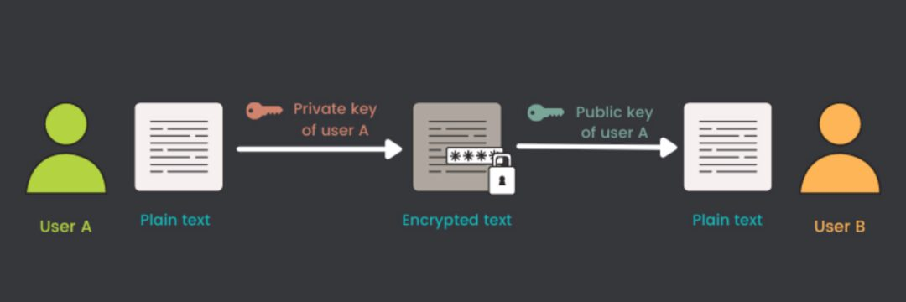
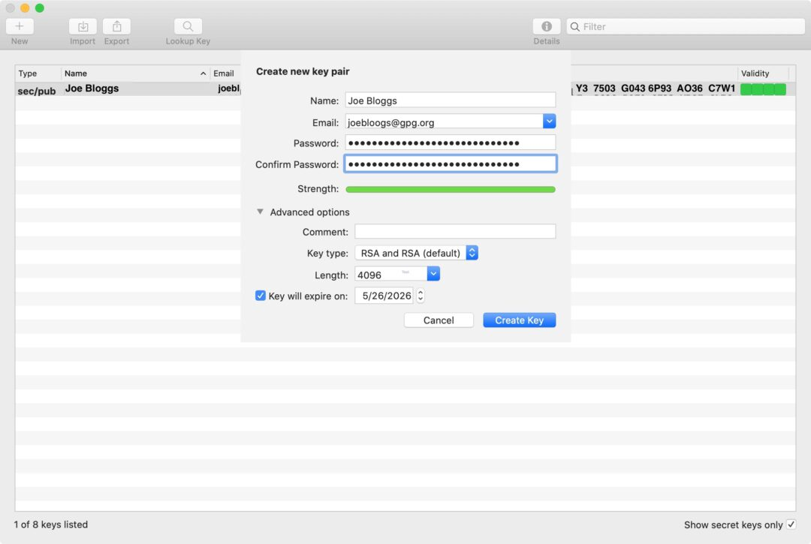
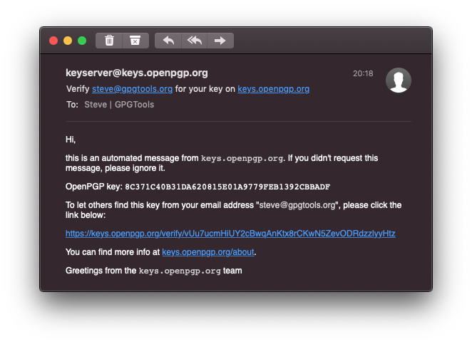
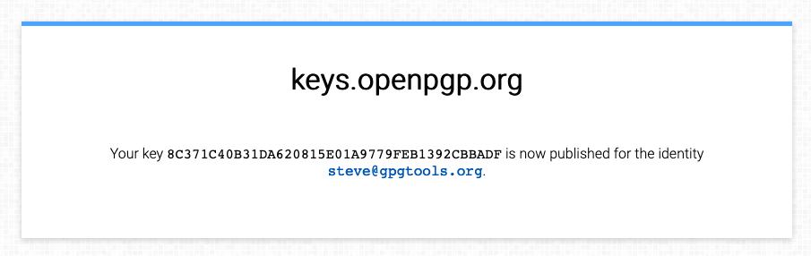
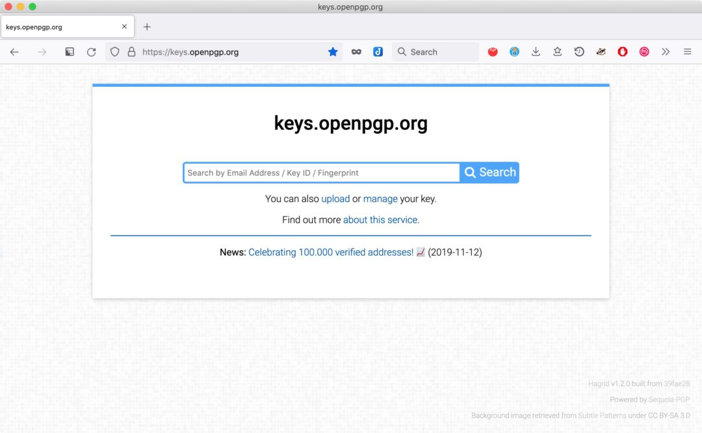
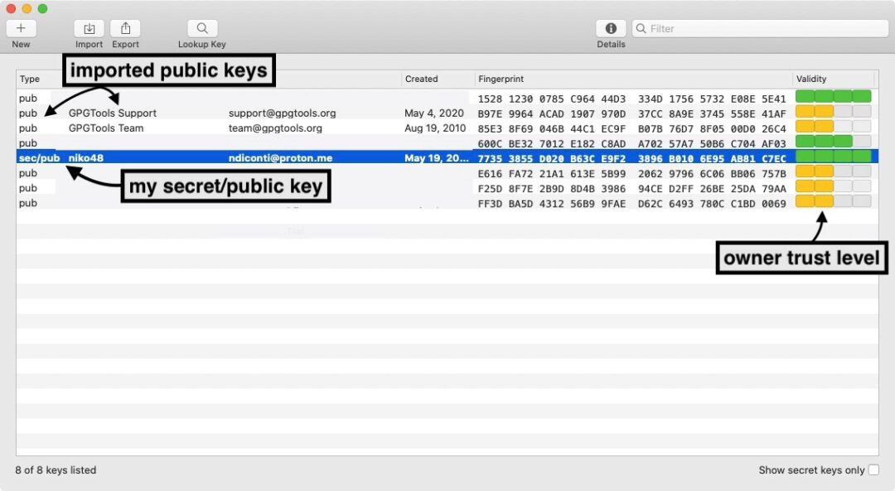
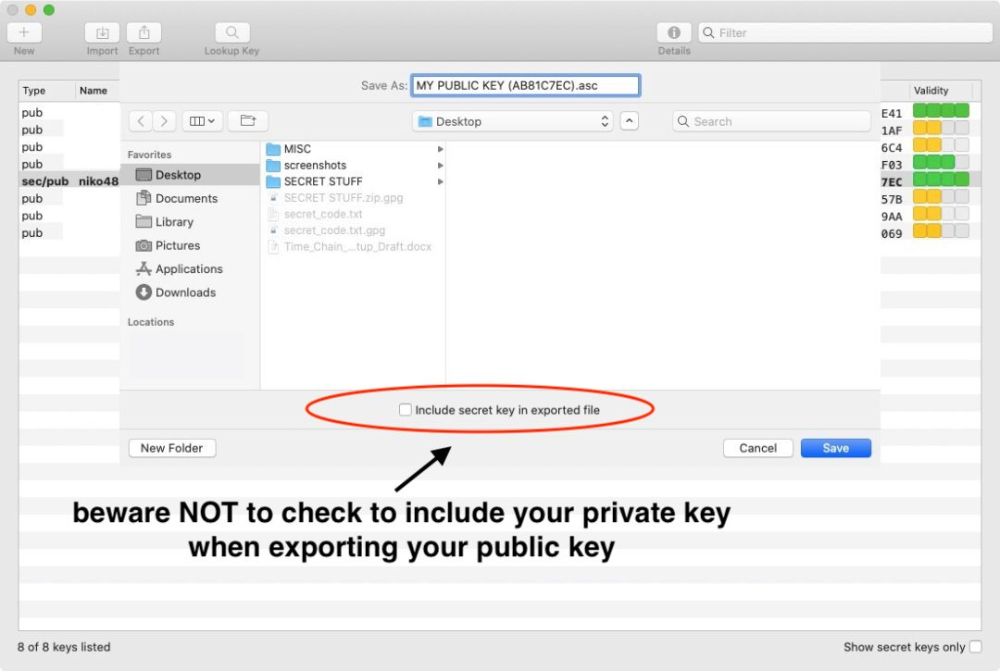
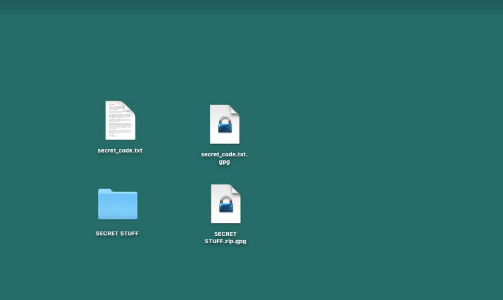
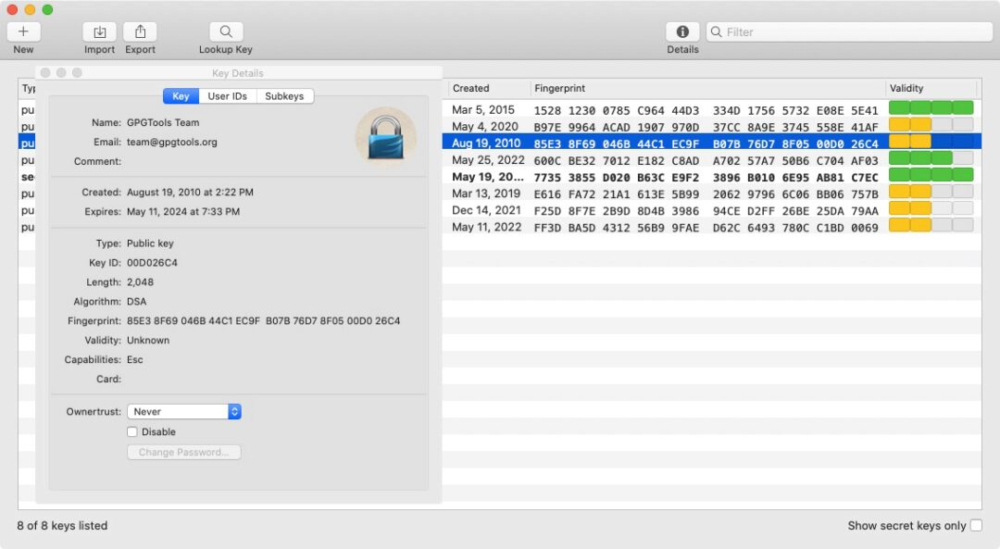

# GPG Encryption 101

[GnuPG, popularly known as GPG](https://gnupg.org/), is an extremely versatile encryption tool. It is widely used as the industry standard for encryption for things like emails, messages, files, or just anything you need to send to someone securely.

GPG (and it's cousin PGP) are commonly used for two things:

1. **Encryption:** encrypt emails and files like Edward Snowden does every day, so bad actors can’t read your encrypted emails and files.
2. **Signing:** create digital signatures for signing documents or your outgoing emails. This ensured the recipient can know the email hasn’t been tampered with or that it is authentic. 

This tutorial will cover using GPG on a MacOS system both via the gui application and the command line. This will get you familiar with the basics of encryption and signature verification, sending private messages and some privacy best practices. 

So why do we need GPG?

## Some first principles

> "Privacy is necessary for an open society in the electronic age. Privacy is not secrecy. A private matter is something one doesn't want the whole world to know, but a secret matter is something one doesn't want anybody to know. Privacy is the power to selectively reveal oneself to the world."

This is the opening line of [A Cypherpunk's Manifesto](https://nakamotoinstitute.org/cypherpunk-manifesto/) by Eric Hughes in 1993. The original cypherpunks believed that privacy was not only a necessity in the digital age but a basic human right. One of their ambitions was to create a digital money which could be transacted without the need for a trusted third party.  

Bitcoin is the solution to this problem. Ultimately what it set out to solve was the problem of double spending, but it did so by using digital signatures in an *open peer-to-peer network*. 

Satoshi Nakamoto wrote about privacy in Bitcoin’s Whitepaper:

> “Some linking of transactions to a common owner is still unavoidable, and could reveal other transactions that belonged to the same owner”

While private transactions on Bitcoin network are not fully anonymous, it is our responsibility as individuals to understand why encryption matters for a trustless network to function.

Privacy in the digital age requires cryptography. This allows us to reveal our data and identity when desired and only to whom desired. This is the essence of privacy. 

As the old adage goes: **don't trust, verify.** 

## Some basics 

Encryption is the process of converting data into secret, incomprehensible code such that only intended parties are capable of understanding the information. 

The [GPG Tools support](https://gpgtools.tenderapp.com/kb/how-to/introduction-to-cryptography#p1) provides a fantastic rabbit hole to dive deeper into the technicalities of cryptography, hash functions, digital certificates etc. 

We will cover many of these topics here but with a focus on the tools and application of them using the command line and some basic exercises. 

## How to use GPG encryption 

GPG keys work by using two files, a private key and a public key. These two keys are tied to each other when we generate a keypair, and are both needed for encrypting and decrypting files.

## Private and Public Keys

- We use our **private key** to encrypt a file, folder or text with GPG. This key is what **we keep secret and secure** FOR YOUR EYES ONLY. This is also the key we use for signing. 

- We then need the paired **public key** to decrypt the file, folder or text which has been previously encrypted. This key can and should be **shared publicly** with desired recipients and/or on a public server. 

- This also works in the opposite direction! Other people can use our public key to encrypt a file, folder or text. The only way it can be decrypted in turn is with your private key.

> In other words, if a file was encrypted with a private key, it can only be decrypted with the corresponding public key. And if a file was encrypted with a public key, it can only be decrypted with the corresponding private key.

## Installing the GPG suite

The [GPG Suite](https://gpgtools.org/) is a fantastic tool for getting started that helps us create, store, export and import private and public keys. 

We will first start to get familiar with encryption using this GUI application to create and manage our keys and do some basic exercises. 

Go to the link and follow the download instructions. 

## Creating a New Keypair 

When you open up the GPG suite, if you have not created a key before the key creation dialogue will appear. 

- Enter a name and email.
- Add a strong passphrase.
- Store your passphrase securely with a password manager. 

> Under advanced options:

- Use the RSA encryption default option

- Add if you want the key to expire on a certain date

## Uploading the key to Keyserver

After setting up a new key pair GPG will ask you if you want to send your public key to the key server. 

If you do this will prompt a verification email something like this:

The GPG default key server is [keys.openpgp.org](https://keys.openpgp.org/). Verifying your public key on the key server means anyone can search for your email address on the key server, and find access to your public key. 

Once the email address is verified your key can be found when others search for your email address on the key server. 

Search [opengpg](https://keys.openpgp.org/) | return mail and public key
------------- | -------------
  | 

See more about the [Keyserver User Guide](https://keys.openpgp.org/about/usage) 

## Backup your keys

You don't want to loose your keys. Yet it can still happen: drive failures, physical damage to your computer or whatever other disasters may strike.

Just like with your Bitcoin seed phrases for your wallet, we highly encourage you to back them up and store them in a secure location. 

As this will be in a `.asc` file containing a lot of code which is hard to write down so we recommend using a an encrypted USB stick that you use ONLY for secret key storage. 

1. On the GPG Suite select key to backup. You can optionally also backup all keys at once.
2. Click `File > Export`  or press `⌘E`
    to include the secret key enable the `Include secret key in exported file` option (do this only to transfer your key to another computer or create a backup.
	
> NEVER SHARE YOUR SECRET KEY VIA EMAIL OR A CLOUD SERVICE!!

3. Click Save
4. Following defaults a file with the following format Name (keyID) – Public.asc or Name (keyID) – Secret.asc in case you opted to also export your secret key will be created

See more on [GPG key backup and recovery](https://gpgtools.tenderapp.com/kb/gpg-keychain-faq/backup-or-transfer-your-keys) here. 

**Important:** If you use the same sec/pub keys on more than one machine, make sure to update or change your keys only on one machine and then always transfer the updated key to your other mac. 

 ## Encrypt your email 

 We highly recommend [setting up you email with GPGTools](https://gpgtools.tenderapp.com/kb/how-to/first-steps-where-do-i-start-where-do-i-begin-setup-gpgtools-create-a-new-key-your-first-encrypted-email#getpublickey) to send, receive and sign encrypted emails with fellow plebs using your GPG keys. 
 
 This is not in the scope of this encryption 101 class, but follow the above link as GPG makes it super easy to setup on your MacOS mail app.

## Importing public keys

When we want to communicate or share files using PGP encryption we need the recipient to have access to our public key, and they need to have ours.

- We can find and import other people's GPG public key from [keys.openpgp.org](https://keys.openpgp.org/), or straight from the GPG Suite app on the Toolbar has a `Lookup Key` which searches the public server. 

When you have a verified email address, you can import it's associated public key. 

Your GPG Suite will end up looking something like this:

## Exporting public keys

To share our public key, right click your newly created key and select `Export`. You can see in the dropdown the various options available. 

This creates a `.asc` file which can be exported to your documents or desktop. Beware if you are sharing your public key with others **DO NOT** check the include secret key box

> ONLY include the private key to backup your keypair or when you want to export your  key pair to another machine that only you access.

Here is the public key file that is created and which you can share with your network:

- Share your public key by uploading the file on the Time Machine Academy discord / gnupg chat. Here you will find other users public keys which you can download and import to your GPG Suite. 

- This now allows you to communicate securely with them, as well as share encrypted files and messages. 

## Encrypting files or folders

1. Right-click the file or folder you want to encrypt in **Finder** and select `Services > OpenPGP: Encrypt File`

2. Select recipients whose public keys you already have imported to encrypt the message with their public keys. Notice you can add an optional passphrase required to decrypt the message. 

> If you only want to encrypt for yourself you need to tick the `Add to Recipients` option in the `Your Key:` section.

3. Optionally sign the file to ensure it did not get tampered with when decrypting after some time.

4. Click Encrypt

5. A new `.gpg` file will be created next to the original file, if you do not want to keep the unencrypted file make sure to delete it securely

You can now share these files with your chosen recipients securely over a public channel or as an email attachment without fear of snooping eyes. 

## Managing your keys

You can right click on any of the keys in the GPG Suite and that will bring up a bunch of options, including seeing the keys and user IDs. 

- A the very bottom you can set the `Owner Trust` level in accordance with a chosen address that you have been verifying and interacting with with greater frequency. The default owner trust of an imported public key is `Never`.

 ## Verifying signatures

 ## Using GPG in the command line

 ## Attaching GPG to your GitHub 

