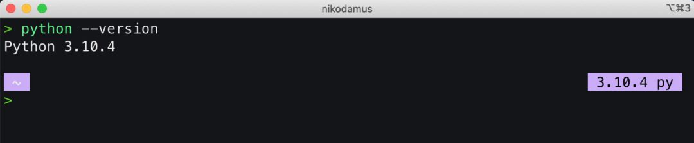
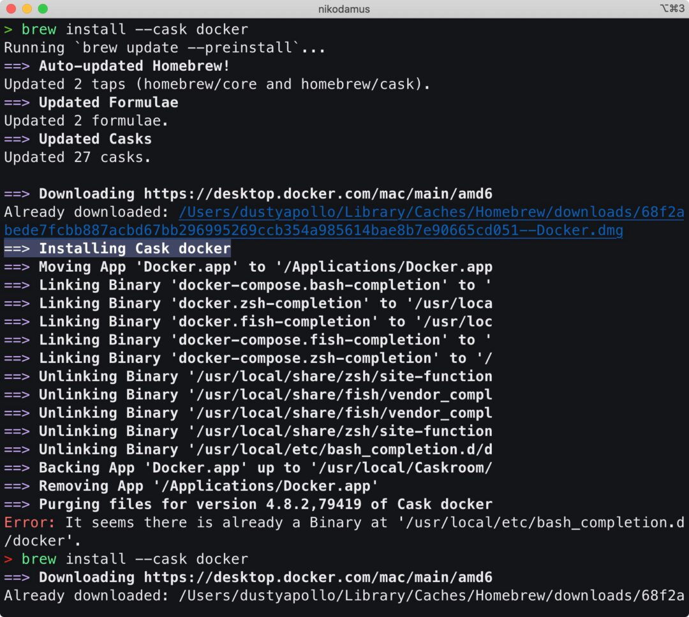
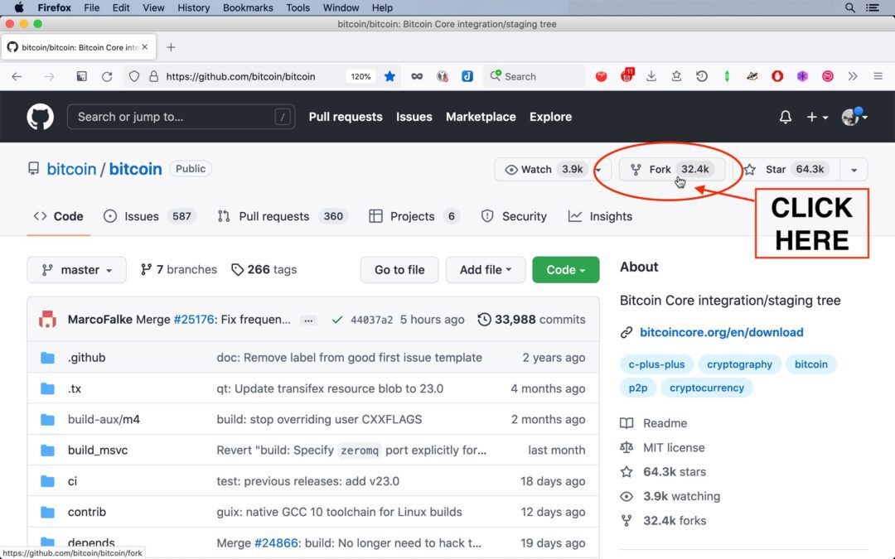
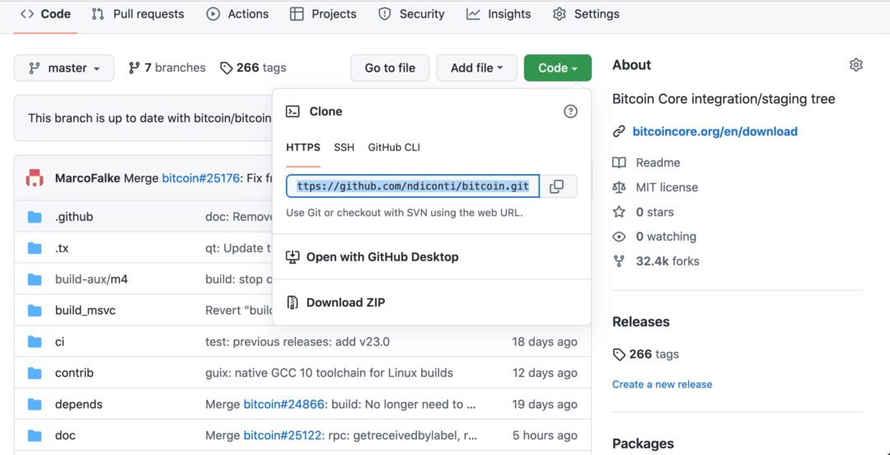
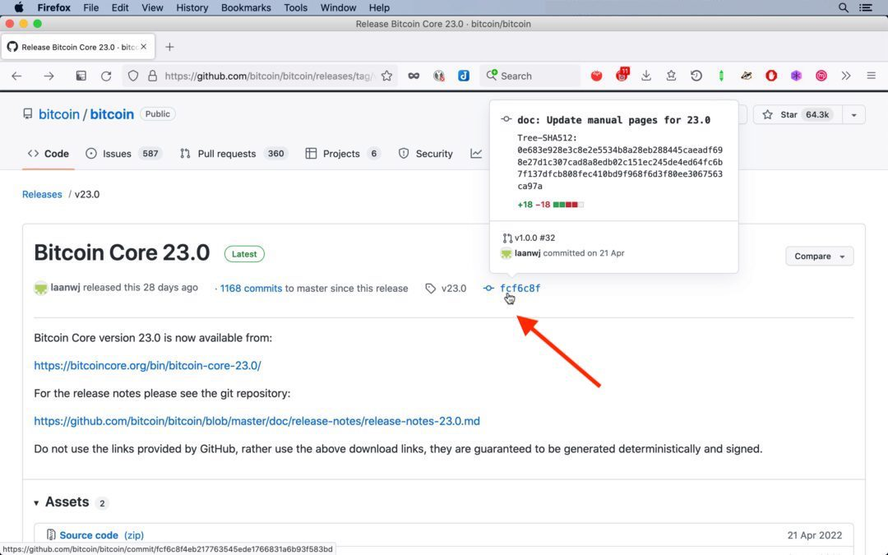
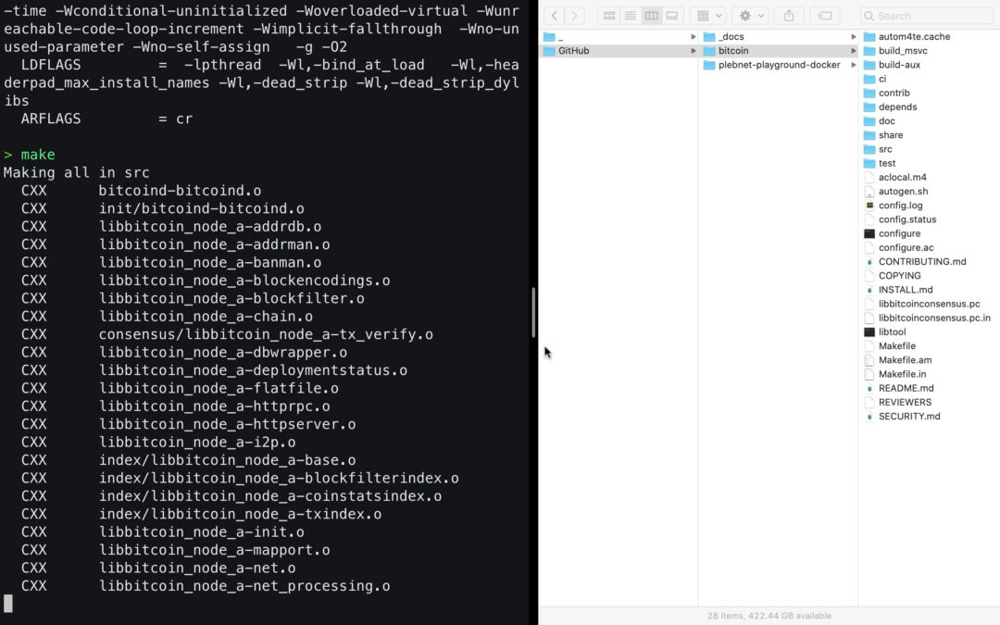
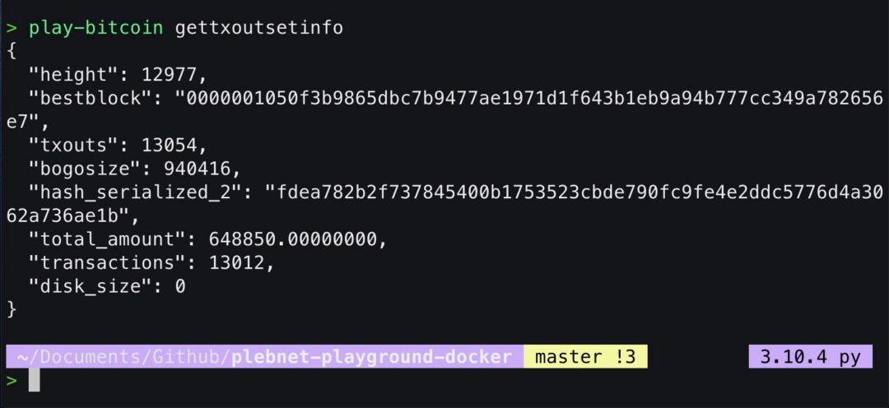
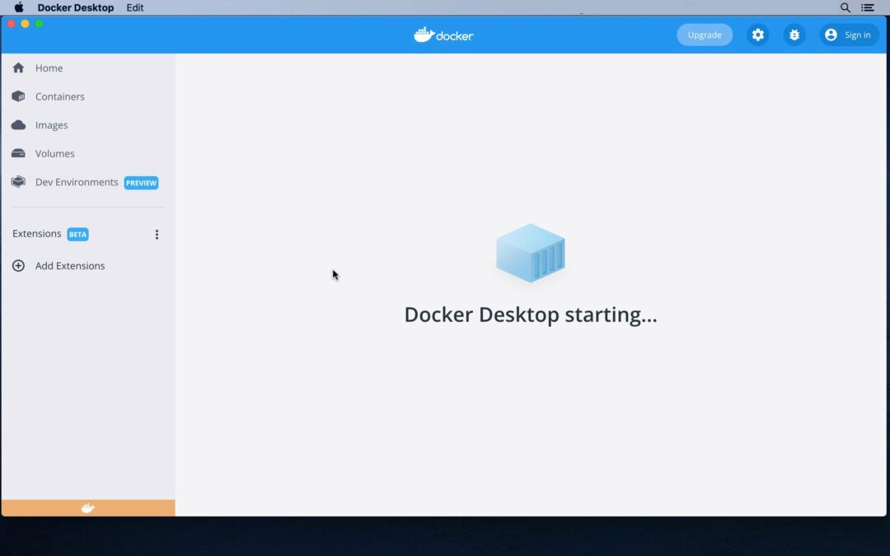

# Setting up Plebnet Playground on MacOS

### Resources:

- [Plebnet Playground Docker Readme](https://github.com/PLEBNET-PLAYGROUND/plebnet-playground-docker)
- [Bitcoin Core](https://github.com/bitcoin/bitcoin)
- [Bitcoin MacOS Build Guide](https://github.com/bitcoin/bitcoin/blob/master/doc/build-osx.md)
- [Plebnet Fun](https://www.plebnet.fun/)

____

## Aim

Plebnet Playground is a sandbox environment to help Bitcoin plebs get under the hood with Lightning LND and mess around without using real sats. This brief tutorial is aimed to help noobies setup Plebnet Playground and Bitcoin Core on MacOS in less that hald and hour.  

**CHECK:** You can install all of this in a virtual environment if you have one. For simplicity we will be doing this on our everyday admin user account. Nothing in this tutorial should break or interfere with the daily running of your machine. 

## Prerequisites

MacOS laptop or desktop running MacOS Mojave or above. We have not tested on earlier versions. I am using MacOS Catalina 10.15 but this process is compatible with later versions as well.

>? are there any known compatability issues with newest M1 chips vs Intel??

- The Xcode Command Line Tools are a collection of build tools for macOS. These tools must be installed in order to build Bitcoin Core from source. More about that [here](https://www.freecodecamp.org/news/install-xcode-command-line-tools/). 

	To install, run the following command from your terminal:

`xcode-select --install`

- You will need a [Github](https://github.com/) account. If you haven't got one, set one up. We will use the git version control to fork and clone both Bitcoin Core and Plebnet Playground onto our local machine. 

NOTE: If you are not familiar with [Git](https://git-scm.com/book/en/v2) yet, don't worry, there is another lesson on this. For the moment just think of it as a version control protocol that allows you to copy *a version* of the source code onto your local machine to then compile and run it locally. 

- Plebnet Playground runs on [Docker](https://www.docker.com/) which is an open-source platform used for developing, deploying, and managing applications in lightweight virtual environments called containers. 

- The default Terminal that runs either bash or zsh and the Homebrew Package manager. 

## Using the Command Line

This tutorial asumes basic to no experience using the Command Line. If this freaks you out **DO NOT WORRY**, follow the steps and you will slowly become familiar with using basic commands, installing the necessary dependencies to run Plebnet Playground and getting under the hood running Bitcoin Core on your machine. 

If you are familiar with CLI already bare with us.

1. If you haven't already, install [Homebrew Package manager](https://brew.sh/). Homebrew helps install packages to their own directory and then symlinks their files into `/usr/local` (on macOS Intel).


> Homebrew makes it super easy and safe to install and uninstall open source software dependencies compatible with Linux. 

```
/bin/bash -c "$(curl -fsSL https://raw.githubusercontent.com/Homebrew/install/HEAD/install.sh)"
```

2. If you haven't already, make sure you have git installed: 

`brew install git` 

Once installed you can use `brew info git` to confirm the version of git you are using:


3. We are also going to need Python 3 installed. Python is a programming language. If you are already managing different python versions consider using [Pyenv](https://realpython.com/intro-to-pyenv/#versions) to manage these, alternatively:

	`brew install python@3`

	check the Python version: 

	`python --version` 

	...and you should see something like:

	
	
3. Now we will install [GNU Make](https://www.gnu.org/software/make/) is a tool which will allow us to build and compile our package source code locally.

	`brew install make` 

	

4. Finally let's install Docker. We could do this straight from the website, but we are now command line ninjas and just need a couple of brewskies:

	`brew install docker-compose`

	

	followed by:

	`brew install --cask docker` 

	

Now we're ready to rock and roll forking our code from Github. 

## Forking repositories

We are going to use Github to "fork" or copy the latest version of the Bitcoin Core and the Plebnet Playground Docker repositories. 

- Enter your Github and follow the links to both accounts.

	- [Bitcoin](https://github.com/bitcoin/bitcoin)
	- [Plebnet Playground](https://github.com/PLEBNET-PLAYGROUND/plebnet-playground-docker)

- Click on the fork button to fork the original repositories into your own Github account. 



- It will ask you to name the new fork, but you can keep the default name. 


Here is what my Github looks like below. You should see both forks under your remote `Repositories` tab. 


## Git cloning repositories

We are now going to use the `git clone` command to yes, clone the version you just forked onto your Github, onto to your local machine. 

Github conveniantly gives you an easy way to copy the comand straight to your terminal. 

- Enter your forked Github repostiory and find the green `Code` button.



- On the drop down you will see options to clone. Unless you already have SSH setup with your Github (Github class) Copy the one under HTTPS. 


- In your Terminal first lets create a new directory in Documents and call it Github. You can do this in the Finder, alternatively type:

	- `cd ~/Documents`
	- `mkdir Github`
	- `cd ~/Documents/Github` 

Now type:

`git clone` and then paste or `CMD + V` the address you just copied. It should look like this only addressed to your own Github:

`git clone https://github.com/addyourgithubhere/bitcoin.git`


Now lets do the same for the same for the Plebnet Playground repo. 

> NOTE: Make sure you are actually inside the directory you want to clone into. 

`git clone https://github.com/addyourgithubhere/plebnet-playground-docker.git` 


Now you should see in your **Finder** window the two cloned repositories something like this:


Pretty cool huh. 

## Git Checkout

Now for the the Bitcoin clone we want to *check out* that the version we have downloaded can be verified with the latest released commit. 

- We do this by going into the Bitcoin/bitcoin original repo, scroll down to the bottom right `Releases > Latest`

- This brings up **Bitcoin Core 23.0** as of time of writing, and on the subheading we can see a hash on the right which begins with `fcf6c8`



- Click on this and we can see the commit hash on the right:

`fcf6c8f4eb217763545ede1766831a6b93f583bd`


Lets copy this and go back to Terminal and type:

`git checkout fcf6c8f4eb217763545ede1766831a6b93f583bd`

This will report back to us: 

```
You are in 'detached HEAD' state. You can look around, make experimental
changes and commit them, and you can discard any commits you make in this
state without impacting any branches by switching back to a branch.
```


This confirms we are indeed using the latest commit. 

## Building Plebnet Docker 

Now we are going to build and compile the code base of the Plebnet Playground Docker. [See here](https://github.com/PLEBNET-PLAYGROUND/plebnet-playground-docker) for the Github README documentation. 

- Enter the directory where the plebnet-playground-docker has been cloned. 

`cd ~/Documents/Github/plebnet-playground-docker`

Now let's compile:

`make init` 


NOTE: If our other dependencies have not been yet installed this will fail as it will require a version of python 3 and docker to work. 

This can be done via `make build` or `make initialize`. See other make commands using just typing  `make`. 


## Install and start all services

`./install.sh`   


## Builiding Bitcoin Core

- Enter the directory where the bitcoin repository has been cloned.

See [MacOs Bitcoin Buildguide](https://github.com/bitcoin/bitcoin/blob/master/doc/build-osx.md). I reccomend reading through this to usnderstand the various dependencies and options available. We will go with a bare bones simple compiliation. 

1. The first step is to download the required dependencies. These dependencies represent the packages required to get a bare bones installation up and running.

`brew install automake libtool boost pkg-config libevent`

> NOTE: These are 5 different dependencies which we are installing in one brew command. Awesome!


> Also we will AVOID installing `berkeley-db@4` dependency because we do not need support for legacy wallets. 

2. Bitcoin Core includes a GUI built with the cross-platform Qt Framework. To compile the GUI, we need to install qt@5. 

`brew install qt@5`


## Configuration

There are various ways to configure Bitcoin core, but we will be doing the bare minimal as we don't require legacy support. 

`./autogen.sh`


Now we add some configuration options to disable tests and other stuff. 

`./configure --disable-tests --disable-man --disable-bench --without-bdb`


Again `db@4` is only required to support for legacy wallets, which we don't need thus `--without-bdb`

## Compiling

Now lets compile Bitcoin Core:

`make`



Now:

`./src/bitcoind -conf=/Users/$(whoami)/Documents/GitHub/plebnet-playground-docker/bitcoin-signet/bitcoin.conf`

> !!! Would like to break down what this command does. We did not make and empty configuration file like in the instructions !!

This will take a while to compile so be patient. 

# Launching Plebnet

From within the plebnet repo we can start to run the play commands:

- `play`
- `play-bitcoin`


- `play-bitcoin gettxoutsetinfo`



- `play-bitcoin-iftop`


- `docker ps` 

To start the docker we can use:


This will prompt Docker Desktop to request priviledged access: 


Docker Desktop will start up:



- `play-lnd`
- `play-lnd newaddress`

`tb1q0yfkqcs384w3hlq8ksgzcgcxq9dmyydg9h9unr`

- `play-getcoins`
- `play-lnd walletbalance`


- `play-bitcoin netinfo 5`


## Ride The Lightning Baby

RTL will at `http://localhost:3000` the default password is `password` and it will ask you to change this on first login.

`open http://localhost:3000`


